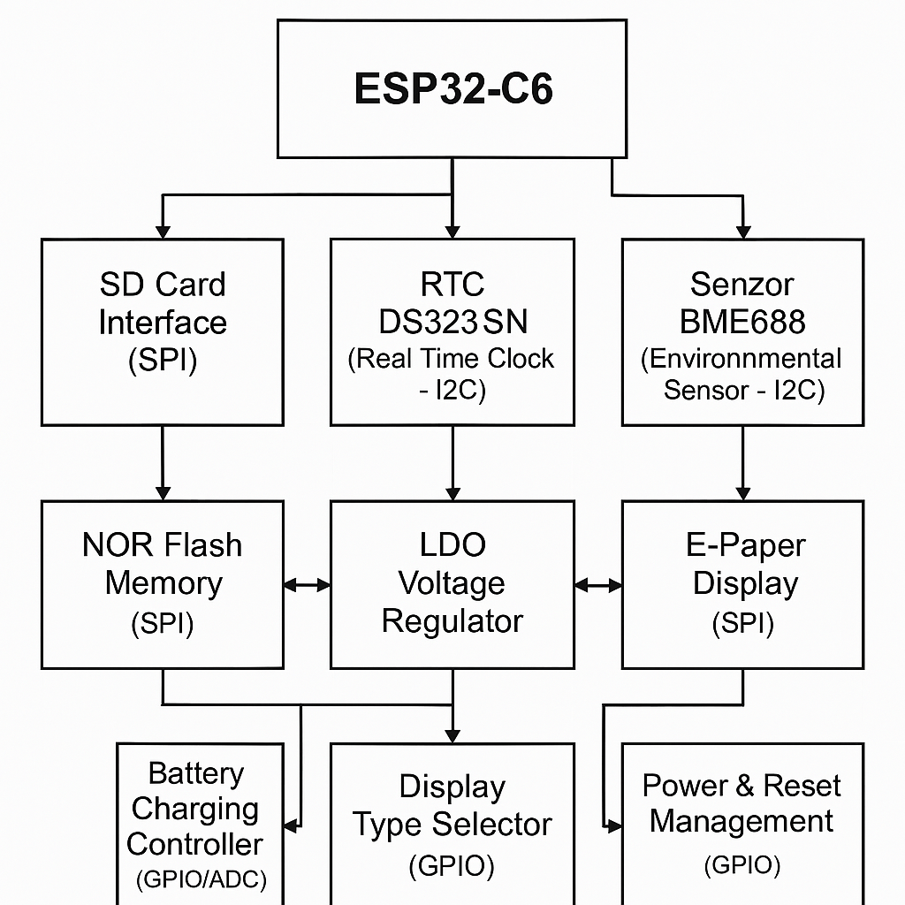

# Open book reader
Am proiectat un E-book reader, fiind construit in jurul microcontrolerului ESP32-C6, cu un incarcator USB-C si slot microSD.

Am urmat mai multi pasi in realizarea acestui poriect:
-	Crearea schematicului 
-	Am plasat componentele pe PCB
-	Am tras circuite si rutele
-	Incarcarea elementelor 3D pe PCB
-	Crearea bateriei si a display-ului
-	Inserarea bateriei, display-ului si a PCB-ului incarcasa 3D
  
# Functionalitati hardware
## ESP32-C6 
Este microcontroller-ul , el controleaza toate componentele si gestioneaza datele.
El foloseste mai multi pini printre care :
1)	Pentru comunicarea SPI cu viteza mare si numar redus de pini avem ( card SD ):   IO6 , IO7 (MOSI) , IO10 (CS) 
2)	Pentru a intra in mod de resetare rapida si mod de programare : IO0 - Buton BOOT , IO3 - Buton Reset
3)	External NOR Flash 64MB (SPI) pentru a extinde memoria: IO2 (MISO) , IO4 (CS) , IO6 (CLK/SCK) , IO7 (MOSI) 
4)	Battery Charge Level (GPIO) : IO12 

5)	Display Type Selector (GPIO): IO14

6)	Environmental Sensor BME688 (I2C) : IO8 (SCL), IO9 (SDA) 
7)	RTC Module DS3231SN (I2C) : IO8 (SCL) - linie de ceas I2C
IO9 (SDA) - linie de date I2C
8)	EPD Power (SPI) : IO6 (CLK/SCK), IO7 (MOSI), IO2 (MISO), IO5 (CS) 

1.	Senzorul de Mediu BME688
o	Interfață: I2C
o	Măsoară temperatura, umiditatea, presiunea, și compușii volatili organici pentru monitorizarea calității aerului.
2.	Memorie Externă NOR Flash 64MB
o	Interfață: SPI
o	Descriere: Folosită pentru stocarea datelor extinse și codului care nu se încadrează în memoria internă a ESP32.
o	Are consum redus în modul standby, crescând în timpul accesărilor de date.
3.	RTC (Real Time Clock) DS3231SN
o	Interfață: I2C
o	Menține timpul real chiar și în absența alimentării principale, utilizând o baterie de backup.
4.	Modulul de Încărcare a Bateriei
o	Interfață: GPIO (pentru monitorizarea stării)
o	Gestionează încărcarea bateriei Li-Po asigurând încărcare sigură și eficientă.
o	Are un consum mic, dependent de starea bateriei și de modul de încărcare.
5.	Regulator de Tensiune LDO
o	Regulează tensiunea de intrare pentru a asigura o alimentare stabilă de 3.3V pentru toate componentele.
Comunicații și Procesare
•	SPI: Utilizat pentru comunicații rapide cu memoria flash și display-ul E-Paper. Acest protocol este ideal pentru transferul de date la viteze înalte, esențial pentru performanța display-ului și accesul rapid la date.
•	I2C: Folosit pentru comunicația cu senzori de mediu și modulul RTC, care nu necesită viteze mari de transfer dar beneficiază de simplificarea conexiunilor.

# Bill of Materials
| Componenta    | Link | Datasheet
| -------- | ------- |--------|
|ESP32_WROVER_SPARKFUN-DISCRETESEMI_MOSFET_PCH-DMG2305UX-7|https://componentsearchengine.com/part-view/DMG2305UX-7/Diodes%20Incorporated|https://www.diodes.com//assets/Datasheets/DMG2305UX.pdf|
| QWIIC_CONNECTORJS-1MM | https://www.snapeda.com/parts/PRT-14417/SparkFun/view-part/     |https://www.snapeda.com/parts/PRT-14417/SparkFun%20Electronics/datasheet/
|CPH3225A|https://www.snapeda.com/parts/CPH3225A/Seiko+Instruments/view-part/?ref=eda|https://www.snapeda.com/parts/CPH3225A/Seiko%20Instruments/datasheet/|
|BUTTON_CUSYOMV1|https://industry.panasonic.com/global/en/downloads?tab=cad&small_g_cd=203&part_no=EVQPUJ02K&q=RVZRUFVKMDJLJTdDMTMlN0MyMDMlN0MzNDU5JTdDMSU3QyU3QyU3Q2ZhbHNl|https://industry.panasonic.com/global/en/downloads?tab=catalog&small_g_cd=203&part_no=EVQPUJ02K&q=RVZRUFVKMDJLJTdDMTMlN0MyMDMlN0MzNDU5JTdDMSU3QyU3QzIlN0NmYWxzZQ%3D%3D
|ESP32_WROVER_EAGLE-LTSPICE_CC0402|https://componentsearchengine.com/part-view/CC0402MRX5R5BB106/YAGEO|https://componentsearchengine.com/Datasheets/2/CC0402MRX5R5BB106.pdf
| ESP32_WROVER_EAGLE-LTSPICE_RR0402  | https://www.snapeda.com/parts/RC0402FR-07226RL/Yageo/view-part/    |https://www.snapeda.com/parts/RC0402FR-07226RL/Yageo/datasheet/
|BD5229G-TR|https://componentsearchengine.com/part-view/BD5229G-TR/ROHM%20Semiconductor|https://datasheet.datasheetarchive.com/originals/distributors/Datasheets_SAMA/f2b9741ef86007909f138d561a359946.pdf|
|DS3231SN|https://www.snapeda.com/parts/DS3231SN%23/Analog+Devices/view-part/?ref=eda|https://www.snapeda.com/parts/DS3231SN%23/Analog%20Devices/datasheet/|
|112A-TAAR-R03_ATTEND|https://store.comet.bg/en/Catalogue/Product/43497/|https://store.comet.bg/en/Catalogue/Product/43497/|
|744043680IND_4828-WE-TPC_WRE|https://www.digikey.sg/en/models/1638515|https://www.we-online.com/components/products/datasheet/744043680.pdf
|ESP32-C6-WROOM-1-N8|https://www.snapeda.com/parts/ESP32-C6-WROOM-1-N8/Espressif+Systems/view-part/?ref=eda|https://www.snapeda.com/parts/ESP32-C6-WROOM-1-N8/Espressif%20Systems/datasheet/
|ADAFRUIT_LEDCHIP-LED0603|https://www.snapeda.com/parts/KP-1608SURCK/Kingbright/view-part/?ref=search&t=LED%200603|https://www.snapeda.com/parts/KP-1608SURCK/Kingbright/datasheet/
|MCP73831|https://www.digikey.com/en/models/1874108|https://ww1.microchip.com/downloads/aemDocuments/documents/APID/ProductDocuments/DataSheets/MCP73831-Family-Data-Sheet-DS20001984H.pdf|
|XC6220A331MR-G|https://componentsearchengine.com/part-view/XC6220A331MR-G/Torex|https://product.torexsemi.com/system/files/series/xc6220.pdf|
|ESP32_WROVER_EAGLE-LTSPICE_CC0402|https://componentsearchengine.com/Datasheets/2/CC0402MRX5R5BB106.pdf|https://componentsearchengine.com/part-view/CC0402MRX5R5BB106/YAGEO|
|ESP32C6_VARISTORCN1812|https://www.mouser.co.uk/ProductDetail/EPCOS-TDK/B72520T0350K062?qs=dEfas%2FXlABIszF52uu7vrg%3D%3D|https://www.tdk-electronics.tdk.com/inf/75/db/CTVS_14/Surge_protection_series.pdf|
|MAX17048G+T10|https://www.snapeda.com/parts/MAX17048G+T10/Analog+Devices/view-part/?ref=eda|https://www.snapeda.com/parts/MAX17048G+T10/Analog%20Devices/datasheet/|
|PGB1010603MR|https://www.snapeda.com/parts/PGB1010603MR/Littelfuse/view-part/?ref=eda|https://www.snapeda.com/parts/PGB1010603MR/Littelfuse%20Inc./datasheet/|
|RCL_CPOL-EUCT3528|https://ro.mouser.com/ProductDetail/Vishay-Sprague/TR3B106K025C1300?qs=jCGqFXxTmLdffnuDkXzk1g%3D%3D|https://www.vishay.com/docs/40080/tr3.pdf|
|FH34SRJ-24S-0.5SH_99_|https://componentsearchengine.com/part-view/XC6220A331MR-G/Torex|https://product.torexsemi.com/system/files/series/xc6220.pdf|
|SAMACSYS_PARTS_USB4110-GF-A|https://componentsearchengine.com/part-view/USB4110-GF-A/GCT%20(GLOBAL%20CONNECTOR%20TECHNOLOGY)|https://gct.co/files/drawings/usb4110.pdf|
|SI1308EDL-T1-GE3|https://componentsearchengine.com/part-view/SI1308EDL-T1-GE3/Vishay|https://componentsearchengine.com/Datasheets/1/SI1308EDL-T1-GE3.pdf|
|MBR0530|https://ro.mouser.com/ProductDetail/KYOCERA-AVX/SD0805S020S1R0?qs=jCA%252BPfw4LHbpkAoSnwrdjw%3D%3D|https://ro.mouser.com/datasheet/2/40/schottky-3165252.pdf|
|SJ|https://grabcad.com/library/solder-jumpers-1||
|W25Q512JVEIQ|https://www.snapeda.com/parts/W25Q512JVEIQ/Winbond+Electronics/view-part/?ref=eda|https://www.snapeda.com/parts/W25Q512JVEIQ/Winbond%20Electronics/datasheet/|
|ESP32_WROVER_BME680_BME680|https://www.snapeda.com/parts/BME680/Bosch/view-part/?welcome=home|https://www.snapeda.com/parts/BME680/Bosch%20Sensortec/datasheet/|
|CPH3225A|https://www.snapeda.com/parts/CPH3225A/Seiko+Instruments/view-part/?ref=eda|https://www.snapeda.com/parts/CPH3225A/Seiko%20Instruments/datasheet/|
|USBLC6-2SC6Y|https://www.snapeda.com/parts/USBLC6-2SC6Y/STMicroelectronics/view-part/?ref=eda|https://www.snapeda.com/parts/USBLC6-2SC6Y/STMicroelectronics/datasheet/|
